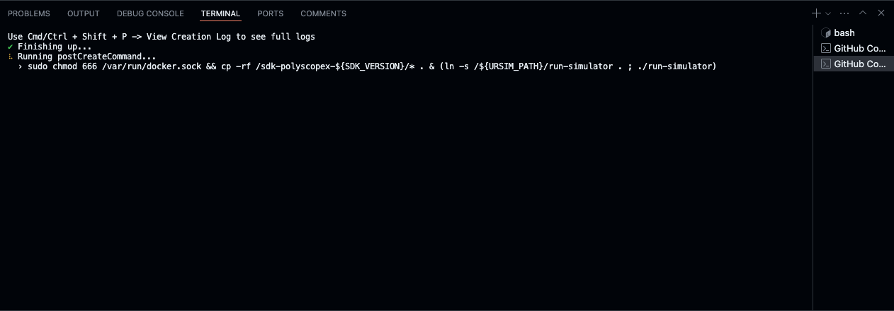
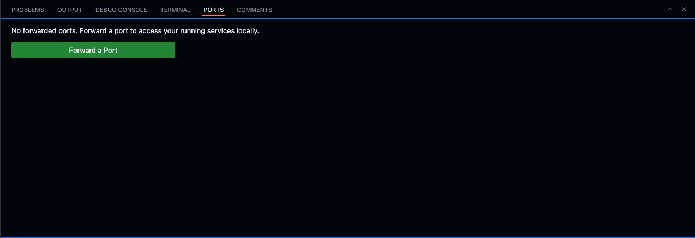

# PolyScope X No Install SDK (Codespace)

This respository contains the PolyScope X SDK and URSim artifacts and is accessible via GitHub Codespace.

## Start Codespace from Repo

1. Open the code drop down, and select the Codespaces tab. You can then choose to create a codespace on master (or any other repository). 

2. A new tab will open, and the codespace will start loading up. You will see a web version of VSCode. It can take a couple minutes to set up a remote connection, and build the codespace. You will know that the workspace has been built successfully when you see the postRunCommands being executed, as shown below. 

After you do this, you can access this cloud workspace [here](https://github.com/codespaces). Any changes to your space become a fork from this repository. 

## URSim & Port Forwarding 
To run the simulator, open a new terminal.  

1. Run the simulator script by using the following command: 
    
    `./run-simulator`

2. Open the PORTS tab next to your terminal. 

3. You will have the option to forward a port here. By default, the simulator is launched on port 80. Enter "80" into the port number field and press enter. 

4. You can now open the dynamically generated link to view and use URSim. 

5. If you want to close the simulator, enter `ctrl + c` into the terminal in which you ran the run-simulator script.

**Note: you can run URSim on a different port by using the port flag with the run-simulator script:**
`./run-simulator --port <PORT_NUMBER>`

**You will need to manually forward the port number you choose, with the steps listed above**

## URCap SDK 
To use the SDK, open a new terminal.

The contents of the SDK are: 
- urcap-generator/  - contains the URCap generator for creating URCap contributions.
- samples/          - contains URCap samples. Build using: npm install && npm run build
- newurcap.sh       - The script for creating a URCap contribution in your current working directory using the generator
- run-simulator      - The script for running URSim. This is a linked file. The full URSim directory can be found at the `/` level.

### New URCap
You can now create a new URCap by running the newURCap.sh shell script. 

Once a new URCap contribution is created using the script, a folder named after it's id is created.

### Build and Deploy URCap 
To create the final zip file for a contribution, go to its folder and run the following commands: 

1. Install the node modules.

    `npm install` 

2. Generate the URCap file in the target directory.

    `npm run build`

3. Deploy to URSim (ensure that URSim is running and open).

    `npm run install-urcap`

You should now see the URCap file in URSim. For more information, refer to the [PolyScope X SDK Official Documentation](https://docs.universal-robots.com) 